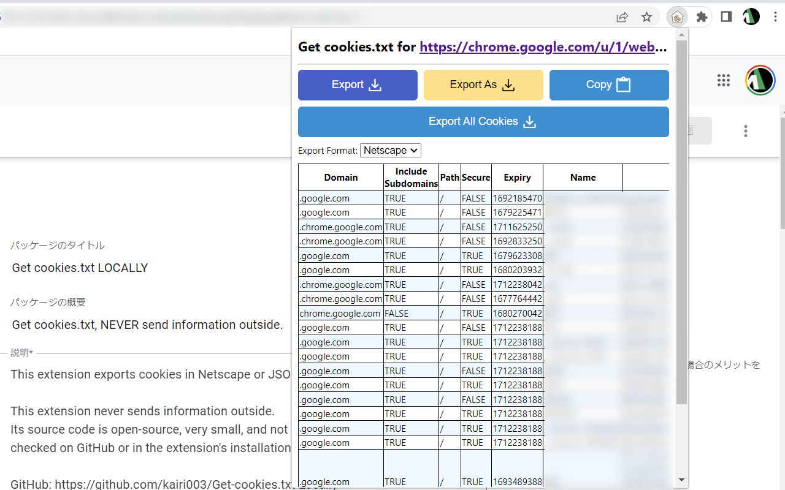

# Get cookies.txt LOCALLY
Get cookies.txt, NEVER send information outside.



This extension exports cookies.txt in Netscape or JSON format.
The Netscape cookies.txt format is compatible with wget, curl, MozillaCookieJar(Python3), and more.

Rest assured that this extension never transmits your information externally.
It features an open-source, unobfuscated source code that is readily available for inspection on GitHub or in the extension's installation directory.

To function correctly, this extension requires certain permissions, all of which are listed in the source code for transparency.
Specifically, it now needs "Download management" to execute a more appropriate file export method, which was previously achieved through "link generation and automatic clicking" in versions before v0.3.x.

- **activeTab**: To get the URL of the current active tab.
- **cookies**: To get and export cookies (not write or send).
- **downloads**: Only used to export local resources (cookies).
- **notifications**: To notify updates.
- **hosts permissions**: To get and export cookies (not write or send).


# Installation
## From WebStore

[link-chrome]: https://chrome.google.com/webstore/detail/get-cookiestxt-locally/cclelndahbckbenkjhflpdbgdldlbecc 'Chrome Web Store'
[link-firefox]: https://addons.mozilla.org/firefox/addon/get-cookies-txt-locally/ 'Firefox Addons'

[][link-chrome]
[][link-firefox]

[][link-chrome]
[][link-chrome] \
[][link-firefox]
[][link-firefox]

- Depending on the status of the review, it may not be the latest version or may not be published yet.
- Some features may be limited in the Firefox version.
- You may need to allow access to site resources from the extension manager.

## From source code (Google Chrome)
1. Download and unzip this repository.
2. Open Extensions(chrome://extensions/).
3. Enable "Developer mode".
4. Click on "Load Unpacked" and open the directory `Get-cookies.txt-LOCALLY/src`.

## Build for Firefox
1. Download and unzip this repository.
2. Merge `src/manifest.json` and `src/manifest-firefox.json` using one of the following methods:
   - `npm install && npm run build:firfox` and install generated `.zip` file.
   - `jq -s '.[0] + .[1]' src/manifest.json src/manifest.firefox.json > src/manifest.json` and install the extension from the `src` rectory.
   - Merge manually.


## Example of extension installation directory (Google Chrome)
### Windows
```
%LOCALAPPDATA%\Google\Chrome\User Data\Default\Extensions\cclelndahbckbenkjhflpdbgdldlbecc
```

### Mac
```
~/Library/Application Support/Google/Chrome/Default/Extensions/cclelndahbckbenkjhflpdbgdldlbecc
```

### Linux
```
~/.config/google-chrome/Default/Extensions/cclelndahbckbenkjhflpdbgdldlbecc
```